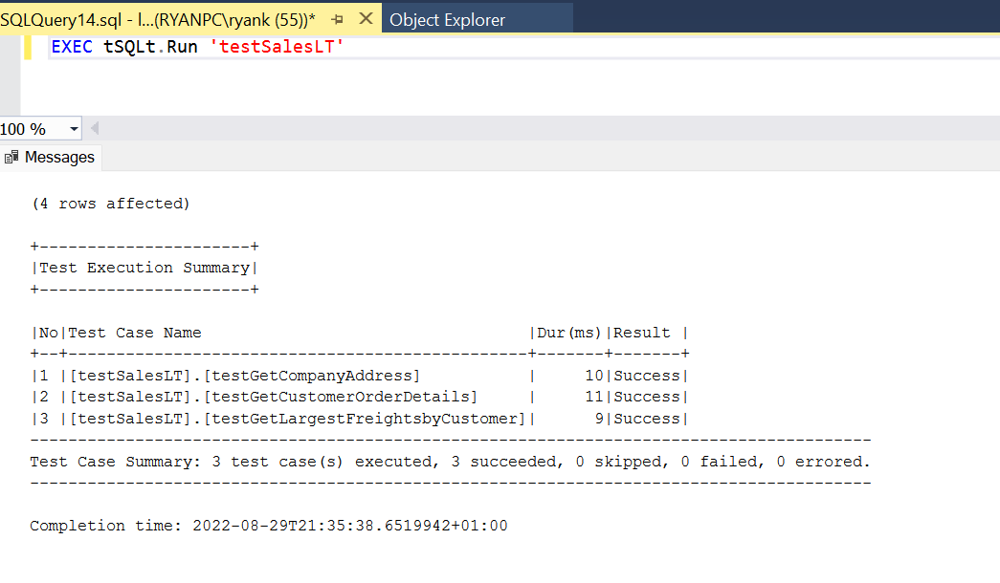
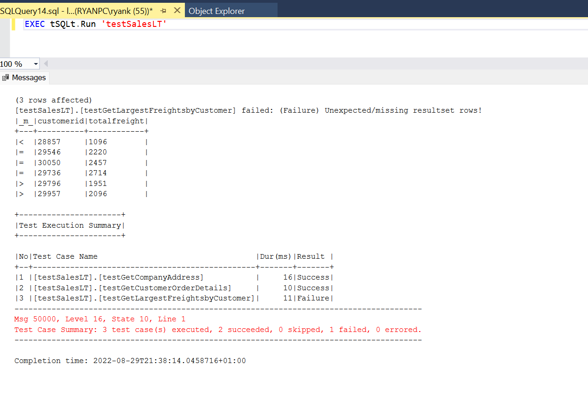
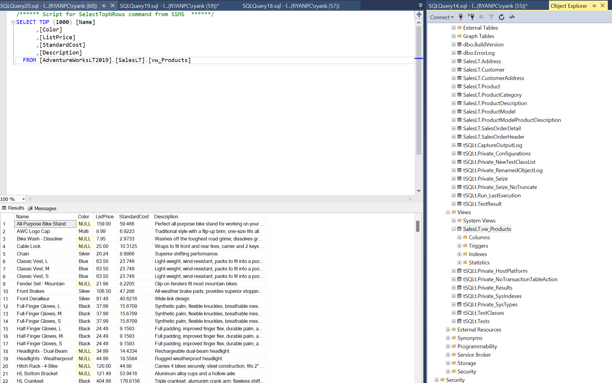
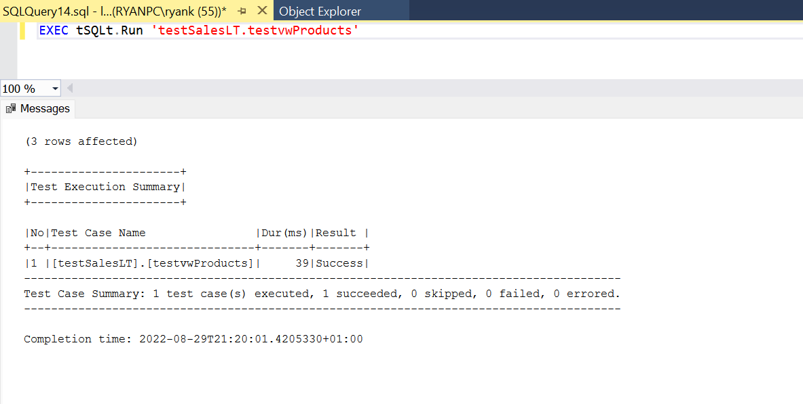
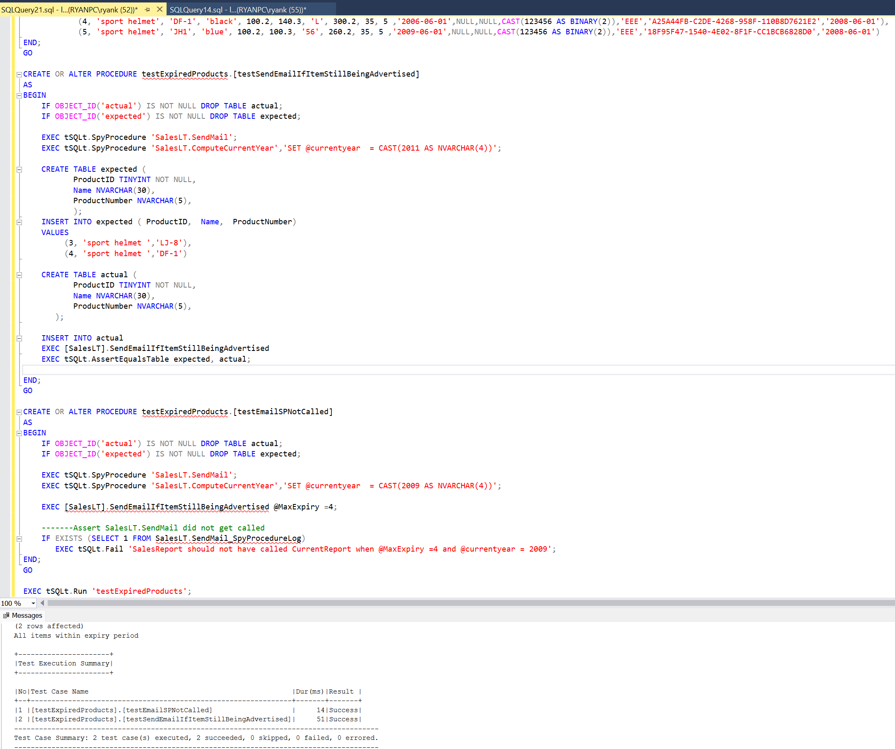
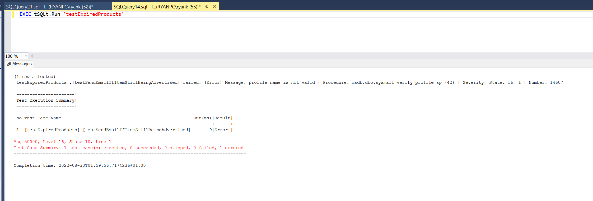

This demo will introduce a package tSQLt, whcih can be used to unit test tsqlt code [1]. All the code used in the 
examples is accessible from this [github repository](https://github.com/ryankarlos/tsqlt_demo).

First we will restore the Adventure Works sample database. This database is based on  Adventure Works Cycles, the fictitious multinational manufacturing company created by Microsoft in 2010 [2]. 
The company manufactures and sells metal and composite bicycles to North American, European and Asian commercial markets. 

## Installation and Setup 

You can download the database backups  [here](https://docs.microsoft.com/en-us/sql/samples/adventureworks-install-configure?view=sql-server-ver16&tabs=ssms) or
from the [db_backup](https://github.com/ryankarlos/tsqlt_demo/tree/master/db_backup) folder in the repository.
In this demo, we will use the 'AdventureWorksLT2019.bak' file corresponding to the lightweight and pared down version of the OLTP sample.
Unzip and move the content to a location where you would like to store all the backups . On Windows, you will need to install 
SQL Server Developer 2019 and SQL Server Management Studio by following this [link](https://www.sqlservertutorial.net/install-sql-server/) or this [blog](https://www.mssqltips.com/sqlservertip/6608/install-sql-server-2019-standard-edition/). 
Then you can follow the instructions on restoring the backup for AdventureWorks databse [here](https://docs.microsoft.com/en-us/sql/samples/adventureworks-install-configure?view=sql-server-ver16&tabs=ssms#restore-to-sql-server)
If you are using a Mac, you can use Azure Data Studio and install sql server using docker.You can follow this [article](https://setapp.com/how-to/install-sql-server) to set this up
and backup the AdventureWorks database .bak file [3]. The only change is that you will have to replace the `AdventureWorks2019.bak` to `AdventureWorksLT2019.bak` as we will be 
using the lightweight version.

The rest of the demo, will assume you are using Management Studio which should be easy to replicate on Azure Data Studio. 
You should have a backup folder already present after installing 
Microsoft SQL server 2019.(`C:\Program Files\Microsoft SQL Server\MSSQL15.MSSQLSERVER\MSSQL\Backup`). Right click on Databases in the object explorer
-> Restore Database and add path to .bak file as in screenshot below. Click OK to restore the database.
Refresh the Database and you should see the `AdventureWorksLT2019` database in the object explorer.


Then check to see you have all the tables in the database and run a select query on one of them.


Now download [tSQLt](https://tsqlt.org/downloads/).Unzip the file to a location on your hard drive.
and execute the PrepareServer.sql file in SSMS. This will enable  CLR and installs a server certificate that allows the 
installation of the tSQLt CLR as described in the [docs](https://tsqlt.org/user-guide/quick-start/)


Next we will need to install tsql to our development database (AdventureWorks), by executing the tSQLt.class.sql script 
(included in the zip file) as described in the [docs](https://tsqlt.org/user-guide/quick-start/#InstallToDevDb).
You should see a bunch of tables (tables folder), views(views folder) and stored procedures (under Programmability -> Stored Procedures)
with tSQLt schema. We will be using some of these stored procedures for testing.


The diagram below was generated using SQL Server Database Diagram Tool in SSMS. For more 
instructions on how to do this, check out this [article](https://www.mssqltips.com/sqlservertip/6269/sql-server-database-diagram-tool-in-management-studio/)
The tables in the database, which contain information about product details, customers, and sales orders, are related 
through primary and foreign keys, as shown here


In tSQLt, a test case is a stored procedure that’s part of a test class and uses tSQLt elements to perform the testing. 
We can develop and test stored procedures and functions in a database.

We have a number of stored procedures in [stored_procedures.sql] and the associated tests for each of the stored procedures stored in the 
[tsqlt](https://github.com/ryankarlos/tsqlt_demo/tree/master/sql/tsqlt) folder.
Open the [stored_procedures.sql] script in SSMS console and execute it. We should see all the procedures created in the object explorer 
with the SalesLT schema.


## Testing 

No we start by looking at one of the test scripts,[test_company_address.sql].

We use the CREATE PROCEDURE statement to create a test case. The procedure name must start with the word “test” and be 
created in an existing test class; otherwise, making the test case is much like creating any other procedure. 
The script creates a test case named "testGetCompanyAddress" in the "testSalesLT" test class:

As you can see, we are using CREATE OR ALTER PROCEDURE statement to create a test case. The critical part of the test case 
is the main body of the procedure definition, between BEGIN and END.

We will first create a temporary tables, `expected`, to store the expected data. We will insert rows we expect the 
procedure to return when it is executed.

```sql

CREATE TABLE expected (
OrderQty SMALLINT,    Name NVARCHAR(200),
ListPrice NUMERIC(6, 2)
);

INSERT INTO expected (OrderQty, Name, ListPrice)
VALUES
        (23,'Classic Vest, S', 63.50),
        (11 ,  'Water Bottle - 30 oz.',4.99 ),
        (12 ,  'Sport-100 Helmet, Black', 34.99 ),
        (15 , 'Short-Sleeve Classic Jersey, XL', 53.99),
        (16 , 'Short-Sleeve Classic Jersey, L', 53.99),
        (17 , 'Bike Wash - Dissolver' ,7.95 )
```

Now create a temporary table `actual`, which will store data once the stored procedure is successfully run. Both temp 
tables schema are the same. We will execute the stored procedure for customer id `29796`

```sql

CREATE TABLE actual (
OrderQty SMALLINT,
Name NVARCHAR(200),
ListPrice NUMERIC(6, 2)
);

DECLARE @custid SMALLINT;
SET @custid = 29796

INSERT INTO actual
EXEC  [SalesLT].GetCustomerOrderDetails @custid
```

Finally, we use the tSQLt AssertEqualsTable stored procedure to compare the data in the `actual` and `expected` tables.
**Note** the expected table has to passed in as first parameter to the procedure, if not using the keyword [7].


```sql
  EXEC tSQLt.AssertEqualsTable expected, actual;
```

Open the [sp_func.sql] script in SSMS console and execute it. These create a couple of stored procedures and one function 
We have a test for each of these procedures and function in [tsqlt] folder. 

Before running the test script  [test_company_address.sql](https://github.com/ryankarlos/tsqlt_demo/blob/master/sql/tsqlt/test_company_address.sql) , you need to create a test class
where the test case will be located. In tSQLt, all tests are collected under a single class. A class is a schema. 
A test class is a schema configured with an extended property that tells tSQLt that it is a test class.
To create a new class, use the NewTestClass procedure. For example, 

```sql
EXEC tSQLt.NewTestClass 'testSalesLT';
```

This creates a new schema for our test cases, so we can organise and execute tests as a group.
We need to create this test class nly once and before running all the scripts for creating our test procedures.
We can add one or more test cases to the test class, which is the case in all the test scripts created in  [tsqlt] folder.

Now we can run the [test_company_address.sql](https://github.com/ryankarlos/tsqlt_demo/blob/master/sql/tsqlt/test_company_address.sql) script described above and create the test stored procedure. 
Now we can run the test case using `EXEC tSQLt.Run testSalesLT`. When we run the test case, it should evaluate 
to true and return the following results:


Now run each of the other test scripts, [test_company_address.sql](https://github.com/ryankarlos/tsqlt_demo/blob/master/sql/tsqlt/test_company_address.sql) and [test_customer_orders.sql](https://github.com/ryankarlos/tsqlt_demo/blob/master/sql/tsqlt/test_customer_orders.sql). If we run
`EXEC tSQLt.Run testSalesLT` after this, we should now see all the test cases run 





### Debugging and test errors

In case, we do make a mistake when creating our test, and the tables are not equal, tsqlt will throw an assertion 
error . For example, in [test_freights_per_customer.sql](https://github.com/ryankarlos/tsqlt_demo/blob/master/sql/tsqlt/test_freights_per_customer.sql), lets assume we created an expected table as below, with the first row 
dropped and the second row modified with different values. 

```sql
INSERT INTO expected (customerid, totalfreight)
VALUES
        (28857 ,1096),
        (29546 ,2220),
        (30050 ,2457),
        (29736, 2714)
```
We will see the error below when running `EXEC tSQLt.Run testSalesLT`. The operators, '=' tells us 
that the rows are equal in both tables. The '<' operator highlights different row `(28857 ,1096)` 
in the  `expected` table and the '>' indicates two different rows in the actual table.




### Faking Tables

We can also use tSQLt’s FakeTable stored procedure, which creates a unique temporary table with the same name as 
the table referenced within the actual stored procedure  we are testing. This will ensure that the data in an 
actual database and the table is not updated or deleted. Any subsequent references we make in our test case to that 
table will always point to the test table and not the actual  table in the database. Then we populate the table with 
test data.
We may want to use fake table to avoid any dependency of on the result of the stored procedure we are testing for example.
This will allow us to test the behavior of the stored procedure in isolation from any external factors. 
If we require to isolate SQL unit test from tables, Faketable will be a good choice so that SQL unit test will 
be more robust.

As an example, the logic in the [views.sql](https://github.com/ryankarlos/tsqlt_demo/blob/master/sql/views.sql) script creates a view of the products description and pricing from 
four tables  'Product', 'ProductModelProductDescription','ProductModel' and ProductDescription'. We want to 
only test the logic that the resulting view contains the data we expect, which can be achieved by inserting our 
own dummy data into each of the tables. The source tables may contain a lot of data, which would make it difficult to 
test. In addition, if one of the tables has a foreign key constraint, we cannot insert any individual row to table, 
unless a related row is inserted into the referenced table as well. If we try doing this we get a foreign key constraint 
violation error.

**Note** Before running the scripts, we will also need to drop the views that come loaded with AdventureWorks e.g. 
`SalesLT.vProductAndDescription``SalesLT.vProductModelCatalogDescription`. This can be done from the object explorer in SSMS or via sql command `DROP VIEW`.
Otherwise inserting rows on faked tables will throw an error  ``Object ' ' cannot be renamed because the object participates 
in enforced dependencies.``. 

Now run the [views.sql] script in SSMS to create a view of the products description and pricing. Check that the view 
is created and query it





Then run the test tsqlt script[test_vw_products.sql] for testing the view. The first part of the script, executes the `FakeTable` tsqlt stored procedure
on each of the source tables the view depends on. 

```sql
EXEC tSQLt.FakeTable @TableName = '[SalesLT].Product';
EXEC tSQLt.FakeTable @TableName = '[SalesLT].ProductModelProductDescription'
EXEC tSQLt.FakeTable @TableName = '[SalesLT].ProductModel'
EXEC tSQLt.FakeTable @TableName = '[SalesLT].ProductDescription'
```

We can then insert data into each of the tables and the create an expected view with data. The view should be updated 
automatically and we can just insert the data from the view into the actual temporary table.

```sql
 CREATE TABLE actual (
       Name NVARCHAR(200) NOT NULL,
       Color NVARCHAR(20),
       ListPrice NUMERIC(6, 2),
       StandardCost NUMERIC(6,2),
       Description NVARCHAR(200),
       );

INSERT INTO actual
SELECT * FROM [SalesLT].[vw_Products]
```

We can then use  the `tSQLt.AssertEqualsTable` as used previously, to compare the expected and actual table.




### Setup Procedure 

A Setup procedure can be called before executing each test case by creating a procedure `[SalesLT].[Setup]`.
In [test_email_for_expired_items.sql], we have defined a setup procedure which will create a fake product table and
insert data to be used by all the tests in the class. We have defined a new test class `testExpiredProducts` 
for this setup procedure as we only want it to execute for a specific group of tests and not the entire test suite.
tsqlt will always check if a stored procedure named SetUp on the test class is defined and if so, it is executed before the test 
case stored procedure is executed.

```sql

EXEC tSQLt.NewTestClass 'testExpiredProducts'
GO

CREATE OR ALTER PROCEDURE testExpiredProducts.[SetUp]
AS
BEGIN
    EXEC tSQLt.FakeTable @TableName = '[SalesLT].Product';
        INSERT INTO [SalesLT].Product
    (ProductID, Name, ProductNumber, Color, StandardCost, ListPrice, Size, Weight, ProductCategoryID, ProductModelID, SellStartDate, SellEndDate, DiscontinuedDate, ThumbNailPhoto, ThumbnailPhotoFileName, rowguid, ModifiedDate)
    VALUES
            (1, 'Road Frame black', 'FR-H', 'black', 1000.2, 1400.3, '60', 1000.2, 18, 6 ,'2009-06-01',NULL,NULL,CAST(123456 AS BINARY(2)),'EEE','43DD68D6-14A4-461F-9069-55309D90EA7E','2008-06-01'),
            (2, 'Road Frame red', 'HJ-U', 'red', 1000.2, 1400.3, '58', 1200.2, 18, 6 ,'2009-06-01',NULL,NULL,CAST(123456 AS BINARY(2)),'EEE','43DD68D6-14A4-461F-9069-55309D90EA7E','2008-06-01'),
            (3, 'sport helmet', 'LJ-8', 'red', 100.2, 140.3, 'M', 200.2, 35, 5 ,'2006-06-01',NULL,NULL,CAST(123456 AS BINARY(2)),'EEE','2E1EF41A-C08A-4FF6-8ADA-BDE58B64A712','2008-06-01'),
            (4, 'sport helmet', 'DF-1', 'black', 100.2, 140.3, 'L', 300.2, 35, 5 ,'2006-06-01',NULL,NULL,CAST(123456 AS BINARY(2)),'EEE','A25A44FB-C2DE-4268-958F-110B8D7621E2','2008-06-01'),
            (5, 'sport helmet', 'JH1', 'blue', 100.2, 100.3, '56', 260.2, 35, 5 ,'2009-06-01',NULL,NULL,CAST(123456 AS BINARY(2)),'EEE','18F95F47-1540-4E02-8F1F-CC1BCB6828D0','2008-06-01')
END;
GO

```

In the next section we will look at spy procedures using the test cases defined in [test_email_for_expired_items.sql](https://github.com/ryankarlos/tsqlt_demo/blob/master/sql/tsqlt/test_email_for_expired_items.sql)

###  Spy procedure

Lets assume we want to send an email alert to a user based on an event in our procedure .e.g if there are items 
which should have been removed from the database after an expiry date. The very first step is to unblock the Stored 
Procedure sp_send_dbmail used for sending emails using SQL Server otherwise when you execute the Stored 
Procedure you will get an error.

```sql
SP_CONFIGURE 'show advanced options', 1
RECONFIGURE WITH OVERRIDE
GO

SP_CONFIGURE 'Database Mail XPs', 1
RECONFIGURE WITH OVERRIDE
GO

SP_CONFIGURE 'show advanced options', 0
RECONFIGURE WITH OVERRIDE
GO

```

The script [send_email_for_old_items_advertised.sql](https://github.com/ryankarlos/tsqlt_demo/blob/master/sql/send_email_for_old_items_advertised.sql) contains three stored procedures. `[SalesLT].ComputeCurrentYear`
calculates the current year from the current datetime. `[SalesLT].SendEmailIfItemStillBeingAdvertised` calls this procedure to
return the current year. It then uses this to check the time since the items in products table were on sale and if they 
are older than the expiry date @MaxExpiry parameter which defaults to 3. If this is true, then it will select the items
in the table and also call the `[SalesLT].[SendMail]` procedure which calls the  `sp_send_dbmail` system stored procedure
to send an email to 'Joe Bloggs' with a subject and body. 

```sql
CREATE OR ALTER PROCEDURE [SalesLT].SendEmailIfItemStillBeingAdvertised (@MaxExpiry INTEGER =3)
AS
BEGIN
    DECLARE @year NVARCHAR(4);
    EXEC [SalesLT].ComputeCurrentYear @currentyear = @year OUTPUT;

    IF (SELECT COUNT(*)
            FROM [SalesLT].Product
            WHERE (@year - YEAR(SellStartDate)) > @MaxExpiry
            ) > 0
        BEGIN
            SELECT ProductID,  Name,  ProductNumber
            FROM [SalesLT].Product
            WHERE (@year - YEAR(SellStartDate)) > @MaxExpiry;
            EXEC [SalesLT].[SendMail];
        END
    ELSE
        PRINT 'All items within expiry period'
END;
GO
```

The first test case `testEtestSendEmailIfItemStillBeingAdvertised` checks the output and `testEmailSPNotCalled` will 
test check the

We will mock the `[SalesLT].[SendMail]` procedure as we do not want to call the Database Mail and we should eliminate the 
dependency of the database mail configuration, when writing tests. It may be the case, that in a development environment,
the mail is not configured and even if it was, we do not want to be pinging `Joe Bloggs` everytime our test executes.
We also mock `SalesLT.ComputeCurrentYear` and instead return a mocked output year.

```sql
    EXEC tSQLt.SpyProcedure 'SalesLT.SendMail';
    EXEC tSQLt.SpyProcedure 'SalesLT.ComputeCurrentYear','SET @currentyear  = CAST(2011 AS NVARCHAR(4))';
```

We can execute the `[SalesLT].SendEmailIfItemStillBeingAdvertised` and based on the data in the faked product table setup,
it should return two items which are older than the default expiry date of 3 years.

We can also check that the SalesLT.SendMail was called once. When a mock stored procedure is called, it creates a 
special table and stores the called parameters into this table. The table name is created by adding “_SpyProcedureLog” 
to the end of the mocked stored procedure (`SalesLT.SendMail_SpyProcedureLog`). 

```sql
    DECLARE @callcount TINYINT
    SET @callcount = (SELECT COUNT(*) FROM SalesLT.SendMail_SpyProcedureLog)

    EXEC tSQLt.AssertEquals 1, @callcount
```

The second test case `testEmailSPNotCalled` checks if the mocked procedure `SalesLT.SendMail` is not called
when the items are within the max expiry(which is overridden to 4 years).
If it is called, we will force the test to fail with a sensible message.





In the above examples, if we did not have the spy procedure i.e. did not include 
` EXEC tSQLt.SpyProcedure 'SalesLT.SendMail` in any of our test cases, we would get the 
following error as we have not actually configured a profile for `joe bloggs`for sending an email to 
using the system stored procedure `sp_send_dbmail`.





## Conclusion

There are many more functionalities of tsqlt which are out of the scope of this demo e.g. expecting exceptions, [applying
constraints](https://tsqlt.org/user-guide/isolating-dependencies/applyconstraint/) to fake tables, [applying triggers](https://tsqlt.org/user-guide/isolating-dependencies/applytrigger/).
There also seems to be a very old article on Faking Views, which I have not tested out and have been struggling to 
find a workaround for [8].
Finally, in all the examples above , we have used a single test class `testSalesLT` and executed all the tests in the class by 
passing the class name as a parameter to `tSQLt.Run` procedure .e.g `EXEC tSQLt.Run testSalesLT`. However, if we did 
use multiple test classes and wanted to execute all the tests from different classes at once, we can also 
run `EXEC tSQLt.RunAll`, which will run our entire test suite.

## References

1. tSQLt documentation startup guide https://tsqlt.org/user-guide/quick-start/
2. Adventure Works description https://docs.microsoft.com/en-us/previous-versions/sql/sql-server-2008/ms124825(v=sql.100)?redirectedfrom=MSDN
3. Setup SQL Server and Azure Data Studio on Mac https://setapp.com/how-to/install-sql-server
4. SSMS Database Diagram Tool https://www.mssqltips.com/sqlservertip/6269/sql-server-database-diagram-tool-in-management-studio/
5. Tutorial on SQL Server Unit Testing https://www.sqlshack.com/sql-unit-testing-with-the-tsqlt-framework-for-beginners/
6. Blog on SQL Server 2019 setup on Windows https://www.mssqltips.com/sqlservertip/6608/install-sql-server-2019-standard-edition/
7. AssertEqualsTable syntax https://tsqlt.org/user-guide/assertions/assertequalstable/
8. Faking views https://sqlity.net/en/70/faking-views/
