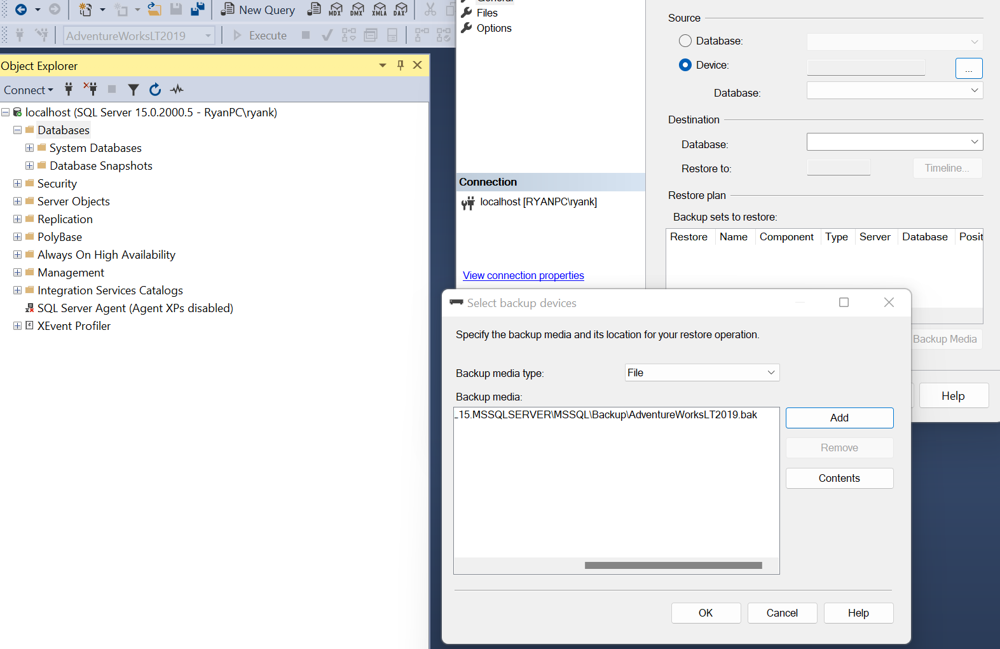
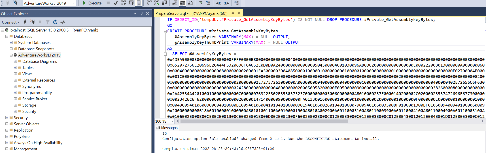
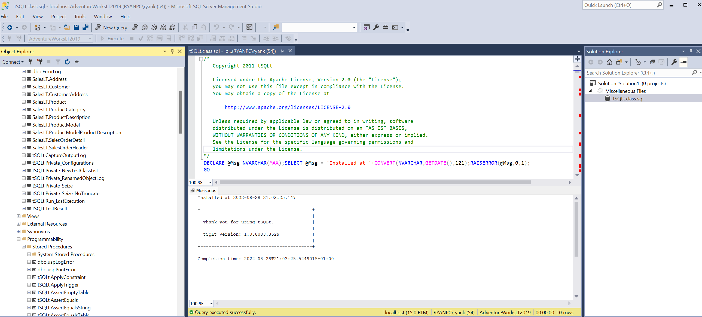
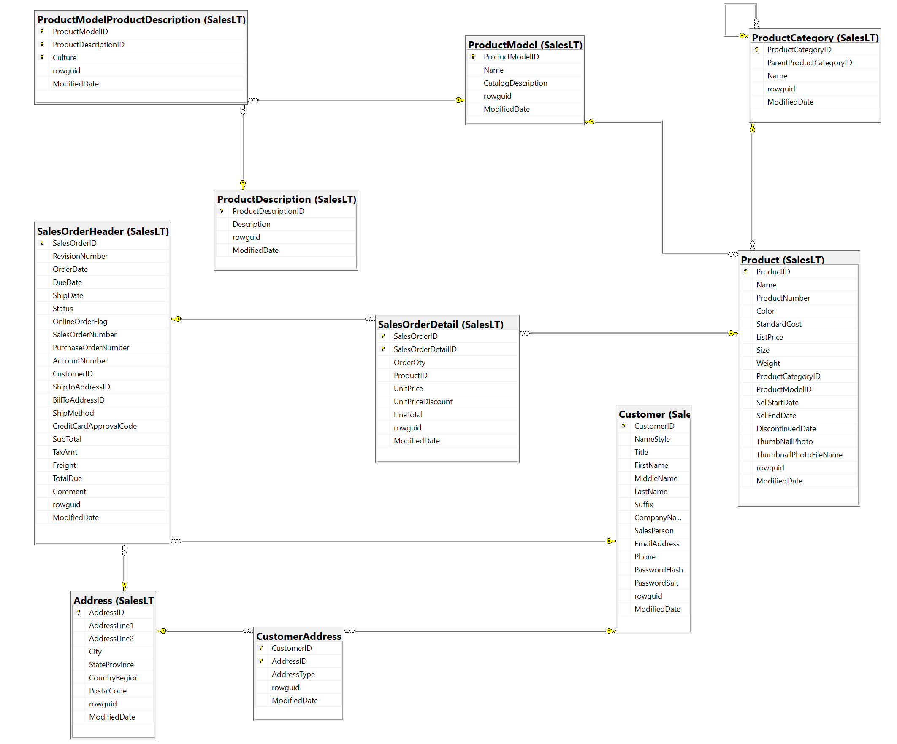
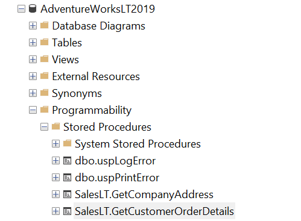
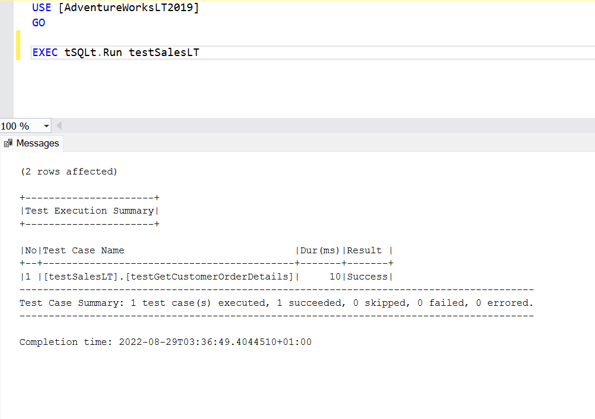

This demo will introduce a package tSQLt, whcih can be used to unit test tsqlt code [1]. All the code used in the 
examples is accessible from this [github repository].

First we will restore the Adventure Works sample database. This database is based on  Adventure Works Cycles, the fictitious multinational manufacturing company created by Microsoft in 2010 [2]. 
The company manufactures and sells metal and composite bicycles to North American, European and Asian commercial markets. 

You can download the database backups  [here](https://docs.microsoft.com/en-us/sql/samples/adventureworks-install-configure?view=sql-server-ver16&tabs=ssms) or
from the [db_backup] folder in the repository.
In this demo, we will use the 'AdventureWorksLT2019.bak' file corresponding to the lightweight and pared down version of the OLTP sample.
Unzip and move the content to a location where you would like to store all the backups . On Windows, you will need to install 
SQL Server Developer 2019 and SQL Server Management Studio by following this [link](https://www.sqlservertutorial.net/install-sql-server/) or this [blog](https://www.mssqltips.com/sqlservertip/6608/install-sql-server-2019-standard-edition/). 
Then you can follow the instructions on restoring the backup for AdventureWorks databse [here](https://docs.microsoft.com/en-us/sql/samples/adventureworks-install-configure?view=sql-server-ver16&tabs=ssms#restore-to-sql-server)
If you are using a Mac, you can use Azure Data Studio and install sql server using docker.You can follow this [article](https://setapp.com/how-to/install-sql-server) to set this up
and backup the AdventureWorks database .bak file [3]. The only change is that you will have to replace the `AdventureWorks2019.bak` to `AdventureWorksLT2019.bak` as we will be 
using the lightweight version.

The rest of the demo, will assume you are using Management Studio which should be easy to replicate on Azure Data Studio. 
You should have a backup folder already present after installing 
Microsoft SQL server 2019.(`C:\Program Files\Microsoft SQL Server\MSSQL15.MSSQLSERVER\MSSQL\Backup`). Right click on Databases in the object explorer
-> Restore Database and add path to .bak file as in screenshot below. Click OK to restore the database.
Refresh the Database and you should see the `AdventureWorksLT2019` database in the object explorer.




Then check to see you have all the tables in the database and run a select query on one of them.




Now download [tSQLt](https://tsqlt.org/downloads/).Unzip the file to a location on your hard drive.
and execute the PrepareServer.sql file in SSMS. This will enable  CLR and installs a server certificate that allows the 
installation of the tSQLt CLR as described in the [docs](https://tsqlt.org/user-guide/quick-start/)


Next we will need to install tsql to our development database (AdventureWorks), by executing the tSQLt.class.sql script 
(included in the zip file) as described in the [docs](https://tsqlt.org/user-guide/quick-start/#InstallToDevDb).
You should see a bunch of tables (tables folder), views(views folder) and stored procedures (under Programmability -> Stored Procedures)
with tSQLt schema. We will be using some of these stored procedures for testing.



The diagram below was generated using SQL Server Database Diagram Tool in SSMS. For more 
instructions on how to do this, check out this [article](https://www.mssqltips.com/sqlservertip/6269/sql-server-database-diagram-tool-in-management-studio/)
The tables in the database, which contain information about product details, customers, and sales orders, are related 
through primary and foreign keys, as shown here


Before you create a test case, you need to create a test class where the test case will be located. 
In tSQLt, all tests are collected under a single class. A class is a schema. 
A test class is a schema configured with an extended property that tells tSQLt that it is a test class.
To create a new class, use the NewTestClass procedure. For example, 

```sql
EXEC tSQLt.NewTestClass 'testSalesLT';
```

This creates a new schema for our test cases, so we can organise and execute tests as a group.
We can add one or more test cases to the test class, so let’s get started doing that.

In tSQLt, a test case is a stored procedure that’s part of a test class and uses tSQLt elements to perform the testing. 
We can develop and test stored procedures and functions in a database.

We have a number of stored procedures in [stored_procedures.sql] and the associated tests for each of the stored procedures stored in the 
[tsqlt] folder.
Open the [stored_procedures.sql] script in SSMS console and execute it. We should see all the procedures created in the object explorer 
with the SalesLT schema.



Nowets start by looking at one of the test scripts,[test_company_address.sql].

We use the CREATE PROCEDURE statement to create a test case. The procedure name must start with the word “test” and be 
created in an existing test class; otherwise, making the test case is much like creating any other procedure. 
The script creates a test case named "testGetCompanyAddress" in the "testSalesLT" test class:

As you can see, we are using CREATE OR ALTER PROCEDURE statement to create a test case. The critical part of the test case 
is the main body of the procedure definition, between BEGIN and END.

We will first create a temporary tables, `expected`, to store the expected data. We will insert rows we expect the 
procedure to return when it is executed.

```SQL

CREATE TABLE expected (
OrderQty SMALLINT,    Name NVARCHAR(200),
ListPrice NUMERIC(6, 2)
);

INSERT INTO expected (OrderQty, Name, ListPrice)
VALUES
        (23,'Classic Vest, S', 63.50),
        (11 ,  'Water Bottle - 30 oz.',4.99 ),
        (12 ,  'Sport-100 Helmet, Black', 34.99 ),
        (15 , 'Short-Sleeve Classic Jersey, XL', 53.99),
        (16 , 'Short-Sleeve Classic Jersey, L', 53.99),
        (17 , 'Bike Wash - Dissolver' ,7.95 )
```

Now create a temporary table `actual`, which will store data once the stored procedure is successfully run. Both temp 
tables schema are the same. We will execute the stored procedure for customer id `29796`

```SQL

CREATE TABLE actual (
OrderQty SMALLINT,
Name NVARCHAR(200),
ListPrice NUMERIC(6, 2)
);

DECLARE @custid SMALLINT;
SET @custid = 29796

INSERT INTO actual
EXEC  [SalesLT].GetCustomerOrderDetails @custid
```

Finally, we use the tSQLt AssertEqualsTable stored procedure to compare the data in the `actual` and `expected` tables.

```SQL
  EXEC tSQLt.AssertEqualsTable expected, actual;
```

Open the [stored_procedures.sql] script in SSMS console and execute it. We should see the new procedure 

Run the test case using `EXEC tSQLt.Run testSalesLT`. When we run the test case, it should evaluate to true and return the following results:



### Faking Tables

We can also use tSQLt’s FakeTable stored procedure, which creates a unique temporary table with the same name as 
the table referenced within the actual stored procedure  we are testing. This will ensure that the data in an 
actual database and the table is not updated or deleted. Any subsequent references we make in our test case to that 
table will always point to the test table and not the actual  table in the database. Then we populate the table with 
test data.
We may want to use fake table to avoid any dependency of on the result of the stored procedure we are testing for example.
This will allow us to test the behavior of the stored procedure in isolation from any external factors. 
If we require to isolate SQL unit test from tables, Faketable will be a good choice so that SQL unit test will 
be more robust.

As an example, the logic in the [views.sql] script creates a view of the products description and pricing from 
four tables  'Product', 'ProductModelProductDescription','ProductModel' and ProductDescription'. We want to 
only test the logic that the resulting view contains the data we expect, which can be achieved by inserting our 
own dummy data into each of the tables. The source tables may contain a lot of data, which would make it difficult to 
test. In addition, if one of the tables has a foreign key constraint, we cannot insert any individual row to table, 
unless a related row is inserted into the referenced table as well. If we try doing this we get a foreign key constraint 
violation error.

**Note** Before running the scripts, we will also need to drop the views that come loaded with AdventureWorks e.g. 
`SalesLT.vProductAndDescription``SalesLT.vProductModelCatalogDescription`. This can be done from the object explorer in SSMS or via sql command `DROP VIEW`.
Otherwise inserting rows on faked tables will throw an error  ``Object ' ' cannot be renamed because the object participates 
in enforced dependencies.``. 

Now run the [views.sql] script in SSMS to create a view of the products description and pricing. Then run the test tsqlt script 
[test_vw_products.sql] for testing the view. The first part of the script, executes the `FakeTable` tsqlt stored procedure
on each of the source tables the view depends on. 

```SQL
EXEC tSQLt.FakeTable @TableName = '[SalesLT].Product';
EXEC tSQLt.FakeTable @TableName = '[SalesLT].ProductModelProductDescription'
EXEC tSQLt.FakeTable @TableName = '[SalesLT].ProductModel'
EXEC tSQLt.FakeTable @TableName = '[SalesLT].ProductDescription'
```


We can then insert data into each of the tables and the create an expected view with data. The view should be updated 
automatically and we can just insert the data from the view into the actual temporary table.

```SQL
 CREATE TABLE actual (
       Name NVARCHAR(200) NOT NULL,
       Color NVARCHAR(20),
       ListPrice NUMERIC(6, 2),
       StandardCost NUMERIC(6,2),
       Description NVARCHAR(200),
       );

INSERT INTO actual
SELECT * FROM [SalesLT].[vw_Products]
```

We can then use  the `tSQLt.AssertEqualsTable` as used previously, to compare the expected and actual table.


###  Setup and teardown procedure

In all the examples, we have used a single test class `testSalesLT` and executed all the tests in the class by 
passing the class name as a parameter to `tSQLt.Run` procedure .e.g `EXEC tSQLt.Run testSalesLT`. However, if we did 
use multiple test classes and wanted to execute all the tests from different classes at once, we can also 
run `EXEC tSQLt.RunAll`, which will run our entire test suite.

## References

1. tSQLt documentation startup guide https://tsqlt.org/user-guide/quick-start/
2. Adventure Works description https://docs.microsoft.com/en-us/previous-versions/sql/sql-server-2008/ms124825(v=sql.100)?redirectedfrom=MSDN
3. Setup SQL Server and Azure Data Studio on Mac https://setapp.com/how-to/install-sql-server
4. SSMS Database Diagram Tool https://www.mssqltips.com/sqlservertip/6269/sql-server-database-diagram-tool-in-management-studio/
5. Tutorial on SQL Server Unit Testing https://www.sqlshack.com/sql-unit-testing-with-the-tsqlt-framework-for-beginners/
6. Blog on SQL Server 2019 setup on Windows https://www.mssqltips.com/sqlservertip/6608/install-sql-server-2019-standard-edition/